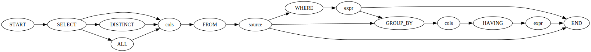

# Query Builder
A python module for building sql-queries using method chaining. This package is unique in the way that a query all methods on a query will always be valid SQL keywords in the current context.

The following code works as expected:
```python
from query_builder import Query

# Create a simple query
q = Query().SELECT("*").FROM("people").WHERE("age > 18")

# Convert to string and print
print(q.sql())
```

*Output:* `SELECT * FROM people WHERE age > 18`

Now let's try with an invalid keyword order.

```python
from query_builder import Query

# Create a query with invalid order of keywords
Query().SELECT("*").WHERE("age > 18").FROM("people")
```

*Output:*
```
Traceback (most recent call last):
  File "/the/current/file.py", line 4, in <module>
    Query().SELECT("*").WHERE("age > 18").FROM("people")
    ^^^^^^^^^^^^^^^^^^^^^^^^^
AttributeError: 'SELECT' object has no attribute 'WHERE'
```

The `SELECT` method returns an object which only has the syntactically correct keywords.

This also helps the LSP tremendously when providing completions, by only allowing the LSP to give completions which lead to a valid SQL syntax.


## How it Works
This package works by generating classes with only the correct methods from a [grammar file](./src/generator/grammar.dot). This file describes the grammar of an SQL query. It is in the [dot](https://graphviz.org/doc/info/lang.html) format, and can be rendered using [graphviz](https://graphviz.org/) as seen below.


